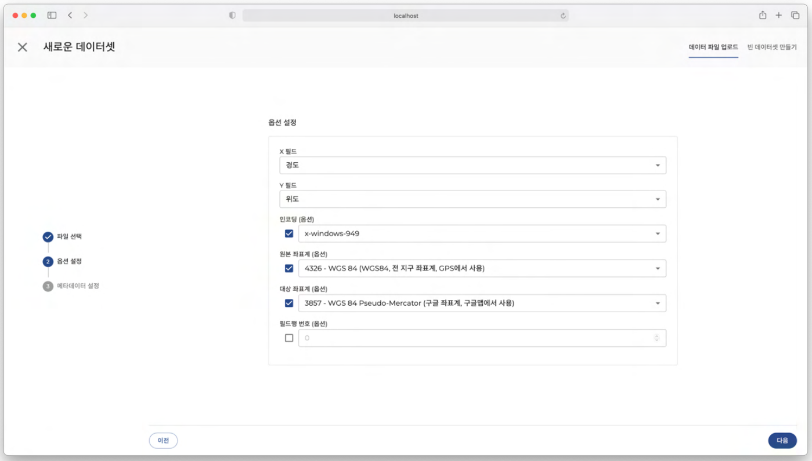
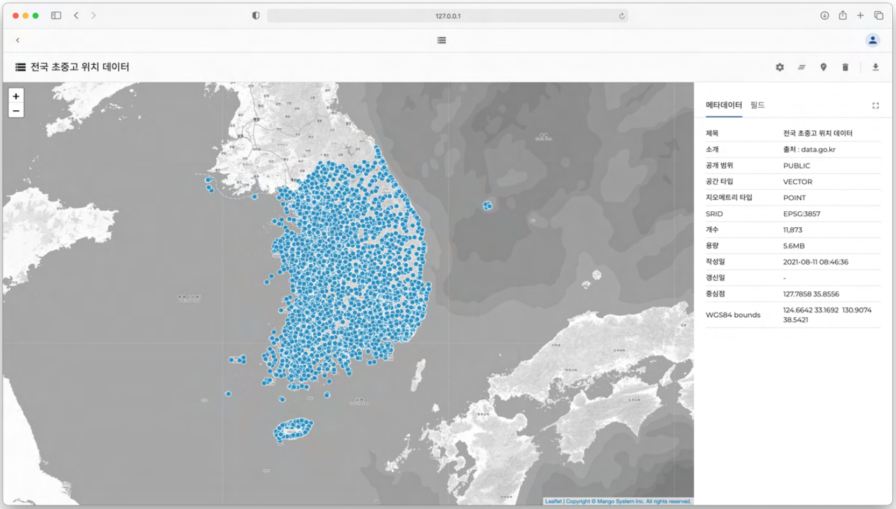
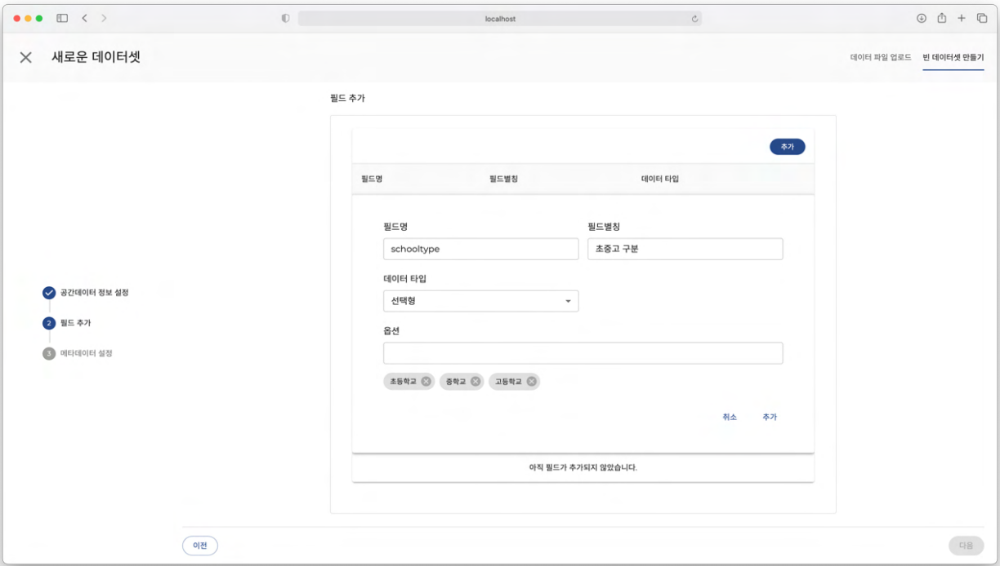

데이터셋
==============================

데이터셋은 레이어 또는 분석을 위해 필요한 데이터들의 모음입니다. 실제 파일 업로드를 통해 만들어지기도 하며, 사용자가 직접 입력하여 데이터셋을 만들 수도 있습니다. 프로젝트 팀원의 권한에 따라 데이터셋을 생성, 수정 또는 삭제를 할 수 있습니다.

**지오메트리 유형**
데이터셋의 기본 유형으로, 크게 3가지로 구분되어 있습니다 포인트(점) 데이터, 라인(선) 데이터, 폴리곤(면) 데이터로 구분됩니다.

**데이터 필드**

데이터셋의 필드는 각각의 정보가 입력되는 최소 단위입니다. 필드마다 입력할 수 있는 데이터 타입은 한가지로 정해져 있으며, 필드는 필수적으로 입력해야 하는 필드와 그렇지 않은 필드로 나뉩니다.

.. list-table::
   :widths: 50 250
   :header-rows: 1

   * - 데이터 타입
     - 특징
   * - 문자형
     - | 문자형 데이터만 입력이 가능합니다. 숫자는 입력이 불가능합니다.
       | 영문 대/소문자, 한글 등
   * - 숫자형
     - | 숫자형 데이터만 입력이 가능합니다. 문자는 입력이 불가능합니다.
       | 정수형, 실수형으로 구분
   * - 선택형
     - | 미리 입력된 데이터 중 선택합니다.
       | 필드 추가 시, 선택할 데이터를 미리 입력해야 합니다.
   * - 예/아니오형형
     - 예/아니오 의 데이터만 입력이 가능합니다.
   * - 날짜형
     - | 날짜형 데이터만 입력이 가능합니다.
       | 예 : 2021-08-11

**메타데이터**

데이터셋의 메타데이터는 데이터셋 이름, 공간 타입, 지오메트리 타입, 개수, 용량, 작성일 등 데이터셋에 대한 정보를 담고 있습니다.

.. list-table::
   :widths: 50 250
   :header-rows: 1

   * - 메타데이터
     - 특징
   * - 제목
     -  데이터셋 제목
   * - 소개
     -  데이터셋에 관한 간략한 설명
   * - 공개 범위
     -  데이터셋의 공개 범위
   * - 공간 타입
     - | 데이터셋의 공간 데이터 타입
       | 포인트 / 라인 / 폴리곤
   * - 지오메트리 타입
     - | 공간데이터의 지오메트리 타입
       | 포인트(MULTIPOINT)
       | 라인(LINESTRING)
       | 폴리곤 (MULTIPOLYGON)
   * - SRID
     -  메타데이터의 좌표계
   * - 개수
     -  데이터의 개수
   * - 용량
     - 데이터의 용량
   * - 작성일
     - 데이터 생성일
   * - 갱신일
     - 데이터 갱신일
   * - 중심점
     - 지도의 중심점(좌표)
   * - WGS84 bounds
     - 지도의 범위(좌상단 좌표, 우하단 좌표)

데이터셋 만들기
-----------------------------

**파일로 데이터셋 만들기**
프로젝트 메뉴의 데이터셋을 클릭합니다. 내가 가지고 있는 파일 파일 Shape , CSV, 엑셀파일을 선택하여 옵션과 메타데이터를 설정하고 업로드하면 데이터셋이 생성됩니다.

아래는 파일로 데이터셋 만들기에서 업로드 가능한 파일의 형식과 설명입니다.

.. list-table::
   :widths: 50 50 250
   :header-rows: 1

   * - 파일형식
     - 확장자
     - 설명
   * - Shape
     - zip
     - | 기하학적 위치 및 속성 정보를 저장하기 위한 벡터 데이터 저장 형식
       | 포인트(점), 라인(선), 폴리곤(면) 형식의 모양으로 저장
       | ZIP으로 압축된 파일 Shape 내부에 아래의 확장자를 가진 필수 파일이 필요(.shp - 지오메트리(기하학적) 지리정보데이터, .shx - 빠르게 데이터를 탐색할 수 있는 데이터 인덱스, .dbf - 속성정보)
       | .prj는 좌표정보를 확인할 수 있는 텍스트 형식의 파일로 포함되어 있지 않을 경우 EPSG:3857이 기본 좌표계로 선택됨
       | 필수 파일 확장자 외 sbn, sbx, fbn, fbx, ain, aih, ixs, mxs, atx, shp.xml, cpg, qix 파일도 존재할 수 있음
       | 최대 10MB까지 업로드 가능
   * - CSV
     - csv, txt
     - | 컴마로 구분된 텍스트 데이터 및 텍스트 파일
       | 컴마(,) 외 콜론(:),세미콜론 (;)도 구분 문자로 사용 가능
       | 최대 3MB까지 업로드 가능
   * - 스프레드시트
     - xlsx, xls
     - | 행과 열을 가진 스프레드시트 엑셀 파일 형식
       | xls : Excel 97-2004 통합 문서
       | xlsx : Excel 통합 문서
       | 최대 3MB까지 업로드 가능

파일로 데이터셋 만들기는 다음과 같은 순서로 진행됩니다.

.. important::
      **파일선택 -> 옵션 설정 -> 메타데이터 설정 -> 업로드**

아래의 내용은 파일로 데이터셋을 만드는 방법에 대해 순서대로 설명합니다.

**1. 파일선택**

1. 데이터셋 화면 오른쪽 상단의 새로운 데이터셋을 클릭합니다.
2. 업로드할 데이터셋 파일을 선택합니다. (선택가능한 파일의 확장자는 Shapefile(ZIP), txt, csv, xls, xlsx입니다.)
3. 선택한 파일명과 함께 파일의 인코딩 형식을 선택할 수 있습니다.

**2-1 옵션 설정 - Shape**

.. image:: images/uploadFileShape.png
    :alt: PINOGIO 데이터셋 - 파일선택 Shape

아래는 파일을 Shape 선택하면 설정할 수 있는 옵션에 대한 설명입니다. (옵션) 표시된 항목은 체크박스 선택 후 값을 변경할 수 있습니다. 값을 입력하지 않거나 체크박스 해제시 기본값이 적용됩니다.

- **인코딩 (옵션) 선택란** 에서 파일에 맞는 인코딩을 선택합니다 기본값은 x-windows-949 입니다.
- **원본 좌표계 (옵션) 선택란** 에서 데이터의 원본 좌표계를 선택합니다 기본값은 'EPSG:3857' 입니다.
- **대상 좌표계 (옵션) 선택란**  에서 좌표변환에 사용할 좌표계를 선택합니다 기본값은 'EPSG:3857' 입니다.

옵션 설정이 완료되면 다음을 클릭합니다.

**2-2 옵션 설정 - CSV**

아래는 파일을 CSV 선택하면 설정할 수 있는 옵션에 대한 설명입니다. X필드 Y필드는 좌표 필드 선택 옵션으로 정확히 입력하지 않으면 파일이 정상적으로 업로드 되지 않습니다. (옵션) 표시된 항목은 체크 박스 선택 후 값을 변경할 수 있습니다. 값을 입력하지 않거나 체크박스 해제시 기본값으로 적용됩니다.

- **X 필드** 선택란에서 데이터의 X좌표 필드 값을 선택합니다. 기본값은 X로 데이터에 필드가 있을 경우 자동으로 선택됩니다.
- **'Y 필드** 선택란에서 데이터의 Y좌표 필드 값을 선택합니다. 기본값은 Y로 데이터에 필드가 있을 경우 자동으로 선택됩니다.
- **인코딩(옵션)** 선택란에서 파일에 맞는 인코딩을 선택합니다. 기본값은 windows-949입니다.
- **원본 좌표계(옵션)** 선택란에서 데이터의 원본 좌표계를 선택합니다. 기본값은 3857 입니다.
- **대상 좌표계(옵션)** 선택란에서 좌표변환에 사용할 좌표계를 선택합니다. 기본값은 3857 입니다.
- **구분자(옵션)** 선택란에서 필드를 구분할 구분자를 선택합니다. 기본값은 컴마 입니다.
- **필드행 번호(옵션)** 선택란에서 필드명으로 사용할 행을 선택합니다. 선택된 행번호가 필드명이 그 이후 행번호부터 데이터로 적용됩니다. 첫 번째 행번호는 0부터 시작됩니다 기본값은  0입니다.

**2-3 옵션 설정 - 스프레드시트**

아래는 스프레드시트(엑셀) 파일을 선택하면 설정할 수 있는 옵션에 대한 설명입니다 X필드, Y필드 좌표 필드 선택 옵션으로 정확히 입력하지 않으면 파일이 정상적으로 업로드 되지 않습니다. (옵션)
표시된 항목은 체크 박스 선택 후 값을 변경할 수 있습니다. 값을 입력하지 않거나 체크박스 해제시 기본값으로 적용됩니다.

- **X 필드** 선택란에서 데이터의 X좌표 필드 값을 선택합니다. 기본값은 X로 데이터에 X필드가 있을경우 자동으로 선택됩니다.
- **Y 필드** 선택란에서 데이터의 Y좌표 필드 값을 선택합니다. 기본값은 Y로 데이터에 Y필드가 있을 경우 자동으로 선택됩니다.
- **인코딩(옵션)** 선택란에서 파일에 맞는 인코딩을 선택합니다. 기본값은 x-windows-949입니다.
- **원본 좌표계 (옵션)** 선택란에서 데이터의 원본 좌표계를 선택합니다. 기본값은 3857 입니다.
- **대상 좌표계 (옵션)** 선택란에서 좌표변환에 사용할 좌표계를 선택합니다. 기본값은 3857 입니다.
- **필드행 번호(옵션)** 선택란에서 필드명으로 사용할 행을 선택합니다. 선택된 행번호가 필드명이고 그 이후 행번호부터 데이터로 적용됩니다. 첫 번째 행번호는 0부터 시작됩니다. 기본값은 0입니다.

**3. 메타데이터 설정**

데이터셋을 소개할 수 있는 제목과 간략한 소개글, 그리고 공개범위를 선택하고 설정합니다.

.. image:: images/metadataSetting.png
    :alt: PINOGIO 데이터셋 - 메타데이터 설정

1. **제목** 필드 입력란에는 데이터셋의 제목을 입력합니다.
2. **공개 범위** 선택란에는 데이터셋의 공개 범위를 선택합니다. (공개 범위의 옵션에 대해서는 아래 표를 참조)
3. **소개** 필드 입력란에는 데이터셋에 대한 소개를 입력합니다.
4. **gPocket 편집허용** 은 이 데이터셋을 gPocket 애플리케이션에서 편집할 수 있도록 설정하는 기능입니다. 기본값은 gPocket에서 편집 비허용 입니다.
5. **업로드** 를 클릭하여 데이터셋을 업로드 합니다.

데이터셋의 공개범위의 종류는 아래와 같습니다.

.. list-table::
   :widths: 50 200
   :header-rows: 1

   * - 옵션명
     - 특징
   * - 전체 공개
     -  모든 피노지오 사용자가 데이터셋에 접근
   * - 팀 사용자에게 공개
     -  프로젝트 팀 사용자만 데이터셋에 접근 가능
   * - 비공개
     -  데이터셋 생성자만 데이터셋에 접근 가능

**4. 업로드된 데이터셋 확인**

파일 업로드가 완료되면 새로 만들어진 데이터셋 페이지로 이동됩니다. 지도에 데이터 위치와 입력한 메타데이터, 필드 정보를 확인하여 데이터가 잘 업로드 되었는지 확인합니다.

지도위에서 도형을 클릭하면 선택한 도형의 속성정보를 팝업으로 확인할 수 있습니다.

.. image:: images/featureInfo.png
    :alt: PINOGIO 데이터셋 - 도형 속성정보 확인

**업로드된 데이터셋의 오류 사항**

데이터 업로드시 잘못된 좌표필드(X필드, Y필드)를 선택하거나 데이터와 다른 좌표계를 선택했을 경우 데이터셋이 정상적으로 생성되지 않을 수 있습니다. 아래는 좌표 필드, 좌표계 설정 또는 데이터가 잘못되었을 때 발생되는 오류 사항에 대한 예시입니다.

.. image:: images/uploadDatasetError.png
    :alt: PINOGIO 데이터셋 - 업로드된 데이터셋의 오류 사항

.. tip::
      Shape 데이터셋을 업로드 해볼 수 있는 샘플(Sample) 데이터셋을 다운로드하려면 아래의 링크를 클릭해주세요.

      :download:`Sample_Shape.zip<files/Sample_Shape.zip>`

      - 아래의 옵션으로 설정 후 업로드 해주세요.

      **원본 : UTF-8 / 인코딩(옵션) : UTF-8 / 원본 좌표계(옵션) : 4326 / 대상 좌표계(옵션) : 자유롭게 선택**

      .. image:: images/uploadShapeTutorial1.png
          :alt: PINOGIO 데이터셋 - 파일선택 Shape 튜토리얼1

      .. image:: images/uploadShapeTutorial2.png
          :alt: PINOGIO 데이터셋 - 파일선택 Shape 튜토리얼2

      .. image:: images/uploadShapeTutorial3.png
          :alt: PINOGIO 데이터셋 - 파일선택 Shape 튜토리얼3

      .. image:: images/uploadShapeTutorial4.png
          :alt: PINOGIO 데이터셋 - 파일선택 Shape 튜토리얼4

.. tip::
      CSV 데이터셋을 업로드 해볼 수 있는 샘플(Sample) 데이터셋을 다운로드하려면 아래의 링크를 클릭해주세요.

      :download:`Sample_CSV.csv<files/Sample_CSV.csv>`

      - 아래의 옵션으로 설정 후 업로드 해주세요.

      **원본 : UTF-8 / x 필드 :  x_coord / y필드 : y_coord / 인코딩(옵션) : UTF-8 / 원본 좌표계(옵션) : 3857 / 대상 좌표계(옵션) : 자유롭게 선택 /  구분자(옵션) : 컴마 / 필드 행 번호(옵션) : 0**

      .. image:: images/uploadCSVTutorial1.png
          :alt: PINOGIO 데이터셋 - 파일선택 CSV 튜토리얼1

      .. image:: images/uploadCSVTutorial2.png
          :alt: PINOGIO 데이터셋 - 파일선택 CSV 튜토리얼2

      .. image:: images/uploadCSVTutorial3.png
          :alt: PINOGIO 데이터셋 - 파일선택 CSV 튜토리얼3

      .. image:: images/uploadCSVTutorial4.png
          :alt: PINOGIO 데이터셋 - 파일선택 CSV 튜토리얼4

.. tip::
      스프레드시트 데이터셋을 업로드 해볼 수 있는 샘플(Sample) 데이터셋을 다운로드하려면 아래의 링크를 클릭해주세요.

      :download:`Sample_XLSX.xlsx<files/Sample_XLSX.xlsx>`

      - 아래의 옵션으로 설정 후 업로드 해주세요.

      **원본 : UTF-8 / x 필드 :  x_coord / y필드 : y_coord / 인코딩(옵션) : UTF-8 / 원본 좌표계(옵션) : 3857 / 대상 좌표계(옵션) : 자유롭게 선택 /  구분자(옵션) : 컴마 / 필드 행 번호(옵션) : 0**

      .. image:: images/uploadXLSXTutorial1.png
          :alt: PINOGIO 데이터셋 - 파일선택 스프레드시트 튜토리얼1

      .. image:: images/uploadXLSXTutorial2.png
          :alt: PINOGIO 데이터셋 - 파일선택 스프레드시트 튜토리얼2

      .. image:: images/uploadXLSXTutorial3.png
          :alt: PINOGIO 데이터셋 - 파일선택 스프레드시트 튜토리얼3

      .. image:: images/uploadXLSXTutorial4.png
          :alt: PINOGIO 데이터셋 - 파일선택 스프레드시트 튜토리얼4

**비어있는 데이터셋 만들기**

프로젝트 메뉴의 데이터셋을 클릭합니다. 우측 상단의 빈 데이터셋 만들기를 클릭하여 파일을 업로드 하지 않고서도 데이터셋을 만들 수 있습니다.

.. important::
      **공간데이터 정보 설정 -> 필드추가 -> 메타데이터 설정 -> 업로드**

**1. 공간데이터 정보 설정**

.. image:: images/spatialDataInfoSetting.png
    :alt: PINOGIO 데이터셋 - 공간데이터 정보 설정

1. 데이터셋 화면 오른쪽 상단의 **새로운 데이터셋** 을 클릭합니다.
2. 새로운 데이터셋 화면의 오른쪽 상단의 **빈 데이터셋 만들기** 를 클릭합니다.
3. **지오메트리 유형** 선택란에서 새로 만들 데이터셋의 지오메트리 유형을 선택합니다. (지오메트리 유형은 포인트, 라인, 폴리곤이 있습니다.)
4. **영역** 선택란에서 데이터셋의 영역을 선택합니다.( 현재 지도 영역은 우측의 지도 영역만큼을 데이터셋으로 사용하는 옵션이며, 영역 제한 없음을 선택하면 데이터셋의 영역을 제한하지 않습니다.)

**2. 필드 추가**

데이터셋의 필드를 추가하는 기능입니다. 파일을 업로드하여 생성하는 데이터셋은 파일에서 필드를 가져와 설정하지만, 빈 데이터셋을 만들게 되면 사용자가 필드를 직접 추가해야 합니다.

1. 필드 추가화면 우측 상단의 **추가** 를 클릭합니다.
2. **필드명** 입력란에 필드 이름을 입력합니다.
3. **필드별칭** 입력란에 필드의 별칭을 입력합니다.
4. **데이터 타입** 선택란에서 필드의 데이터 타입을 선택합니다. (데이터 타입에 따른 입력방법은 아래에서 설명)
5. **추가** 를 클릭하여 입력한 필드를 추가합니다.
6. 원하는 필드가 모두 추가되었으면, **다음** 을 클릭하여 메타데이터 설정화면으로 넘어갑니다.

다음은 필드 추가시 입력하는 항목의 종류와 특징에 대한 설명입니다.

.. list-table::
   :widths: 50 200
   :header-rows: 1

   * - 입력항목
     - 설명
   * - 필드명
     - | 최소 4 , 10 글자 이상 글자 이하
       | 시작단어를 숫자로 입력 불가능
       | 대문자 입력 불가능
       | 특수문자는 밑줄문자(_)만 허용
   * - 필드별칭
     - | 20글자 이하
       | 한글, 영문, 숫자, 공백 사용 가능
   * - 데이터 타입
     - | **1) 문자형**
       | - 문자형 값을 입력 받을 수 있도록 설정
       | **2) 숫자형**
       | - 숫자형 값을 입력 받을 수 있도록 설정
       | - 정수형(INTEGER), 실수형(DOUBLE) 값 선택 가능
       | (하단 예시 참조)
       | **3) 선택형**
       | - 사용자가 정의한 값을 입력받을 수 있도록 설정
       | - 옵션은 최대 10개 까지 추가 가능
       | - 옵션 1의 문자 열 최대 길이는 20자리
       | - 옵션 입력 후 엔터키를 입력하면 추가할 수 있음
       | - 하단에 추가된 옵션을 확인할 수 있고 X 아이콘을 클릭하면 옵션이 삭제 됨
       | (하단 예시 참조)
       | **4) 예/아니오형**
       | - 참/거짓 값을 입력 받을 수 있도록 설정
       | **5) 날짜형**
       | - 날짜형식의 사용자 입력받고자 하는 값을 정할 수 있음

.. note::
      **숫자형** 예시

      .. image:: images/numberTypeExample.png
          :width: 500
          :alt: PINOGIO 데이터셋 - 숫자형 예시

      |

      **선택형** 예시

      .. image:: images/selectTypeExample.png
          :width: 500
          :alt: PINOGIO 데이터셋 - 선택형 예시

이후 **메타데이터 설정** 과 **업로드** 절차는 이전과 **파일로 데이터셋 생성하기 절차와 동일** 합니다.

데이터셋 검색하기
-----------------------------

데이터셋은 한 사용자만 만드는 것이 아니라, 프로젝트에 참여중이며 데이터셋을 생성할 수 있는 권한이 있는 팀원 모두가 만들 수 있습니다. 많은 데이터 셋이 존재할 경우 특정 데이터셋을 손쉽게 찾을 수 있는 검색기능이 있습니다.

.. warning::
    여기서부터는 현재 작성중입니다.

