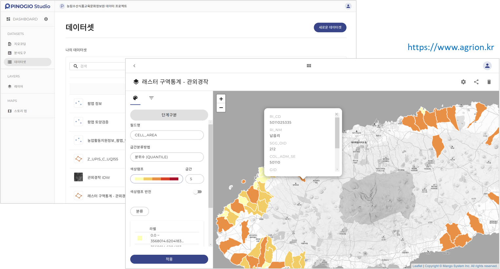

소개
===============

PINOGIO Platform 소개
-----------------------------

**PINOGIO Platform(이하 "피노지오")는 클라우드 기반의 공간데이터 관리 및 분석 플랫폼** 입니다.

피노지오 스튜디오 도구를 이용하여 다양한 형태의 공간데이터 파일을 업로드하고 분석 및 스타일링 스토리
맵 작성 및 공유를 통해 나의 데이터 나의 지도를 다양한 사람들에게 공유하고 협업할 수 있는 공유 플랫폼입니다.

피노지오는는 독립형 서버, 프라이빗 또는 퍼블릭 클라우드 서버에 설치 및 운영이 가능하며, 기관별/조직/부서별 프로젝트 및 사용자 관리가 가능합니다.

.. image:: images/pinogio_intro.png
    :width: 800
    :alt: PINOGIO 소개

PINOGIO Platform 제품명 및 버전 정보
-----------------------------------------------

제품의 공식 명칭은 아래와 같습니다.

- 국문명 : 피노지오 플랫폼 v3.0

- 영문명 : PINOGIO Platform v3.0

PINOGIO Platform 로고
-----------------------------

지원 언어
-----------------------------

피노지오의 현재 지원되는 언어는 아래와 같습니다.

.. list-table::
   :widths: 150 150
   :header-rows: 1

   * - 언어
     - 언어 코드
   * - 한국어
     - ko

시스템 요구 사항
-----------------------------

대용량 데이터 관리 지도 데이터 로딩 지도 데이터 편집시 브라우저에서 많은 양의 메모리 리소스를 요구할 수 있어 불편함 없이 사용하기 위해서는 컴퓨터가 아래에 기술된 최소 기술 사양을 충족해야 합니다.

또한 피노지오는 최신 버전의 Windows 운영체제와 최신 브라우저를 통해서 테스트 되었습니다.

**Windows**

.. list-table::
   :widths: 50 150
   :header-rows: 1

   * -
     - **최소 요구 사항**
   * - 운영 체제 버전
     - Windows 10 이상
   * - 디스플레이
     -  13인치 이상의 디스플레이, 1280x800 해상도
   * - 메모리
     - 4GB RAM
   * - 인터넷
     -  온라인 서비스를 이용하기 위해서 인터넷 연결 필요
   * - 스토리지
     -  클라우드 기반 서비스로 운영 체제 사용에 불편함이 없으면 됩니다.

**지원되는 브라우저**

아래의 브라우저를 지원하지만 Chome 최신 버전에서 가장 많은 테스트가 이뤄졌습니다.

.. list-table::
   :widths: 100 50 150
   :header-rows: 1

   * - 브라우저 명
     - 버전
     - 다운로드 링크
   * - Chome
     - 최신
     - http://google.com/chome/

소프트웨어 유지관리 서비스
-----------------------------

소프트웨어 유지관리 서비스는 피노지오 도입 이후 운영에 필요한 기술지원 서비스를 제공하는 것으로
장애지원, 예방지원 등의 서비스가 포함됩니다.
최초 구입일 또는 계약일로부터 1년 동안의 유지관리 서비스가 무상으로 제공됩니다.
기간 만료 후에는 별도의 유지관리 서비스 계약을 통해 서비스를 제공 받을 수 있습니다.
보다 자세한 유지관리 서비스 항목은 구입시 계약서에 첨부됩니다.

제품 운영 지원 정보
-----------------------------

제품 운영시 궁금한 사항 장애 발생시 고객 지원을 위한 고객지원을 위한 연락처는 아래와 같습니다.

- 고객지원센터 : ㈜망고시스템 ( 운영시간 : 10:00 평일 ~ 17:00)

- 전화번호 : 031-450-3410

- 팩스번호 : 031-450-3414

- 주소 : [14057] 경기도 안양시 동안구 벌말로 126, 2307호 (관양동, 평촌오비즈타워)

라이선스
-----------------------------

.. warning::
    **이 프로그램은 저작권법과 프로그램 보호법에 의해 보호를 받고 있으며 관련 법규에서 명시적으로 허용한 제한적인 범위 이외에 본 소프트웨어 제품을 개작하거나 리버스 엔지니어링, 디컴파일 디어셈블 할 수 없습니다.**

    **이 프로그램은 제작사의 허락 없이 상업적 목적으로 사용할 수 없습니다.**

    **이 프로그램은 제작사의 허락 없이 무단으로 재배포할 수 없습니다.**
