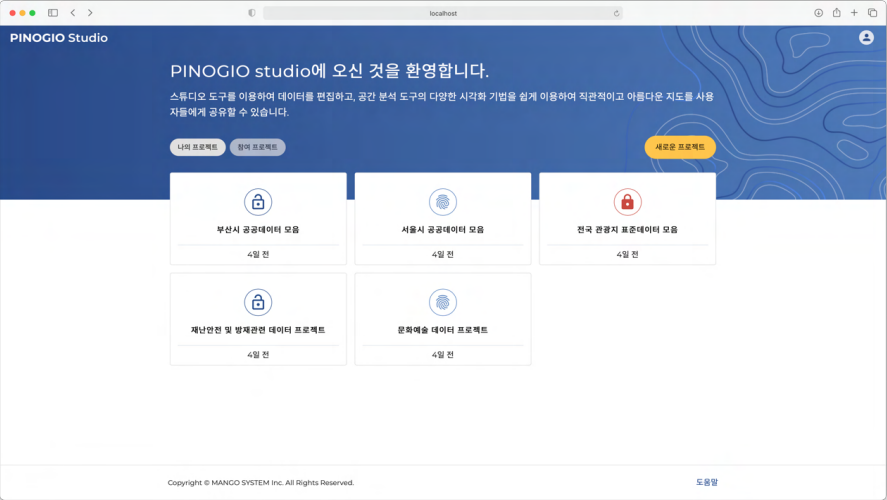
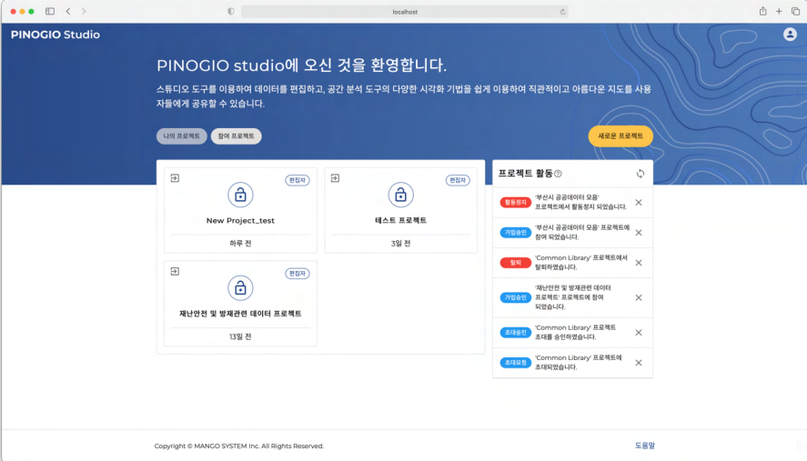

프로젝트
==============================

프로젝트는 사용자의 작업 목적에 따라 다양하게 만들어지는 작업공간입니다.

우리는 컴퓨터를 사용할 때 문서, 이미지, 동영상, 음악 파일의 관리를 위해 다양한 폴더를 만들어 그 곳에 파일을 구분하여 저장합니다. 폴더는 현실 세계에서 서류함과 같은 기능을 하는 것으로 파일을 효율적으로 묶어주는 역할을 합니다.

피노지오에서 이런 폴더 또는 서류함과 같은 기능을 하는 것이 프로젝트입니다. 특정한 주제에 맞게 프로젝트를 만들고 데이터셋, 레이어, 스토리 맵을 만들어 커뮤니티 기능으로 프로젝트 참여자와 협업을 할 수 있습니다.

프로젝트의 이해
-----------------------------

**프로젝트 제목**

프로젝트 제목은 프로젝트를 선택하거나 기존 프로젝트에 참여할 때 구분하는 용도로 사용됩니다. 단순히 구분하는 용도로 사용되어 다른 프로젝트와 제목은 중복될 수 있습니다. 프로젝트 제목은 언제든지 설정을 통해 변경할 수 있습니다.

**프로젝트 ID**

프로젝트의 고유 식별자로 제목과 다르게 중복되는 ID는 존재하지 않습니다. 한 번 할당된 ID는 변경할수 없습니다.

**프로젝트 공개범위**

프로젝트의 공개 범위에 따라 모두 공개하거나, 사용자의 접근을 제한적으로 조절하여 개인적인 공간을 만들 수도 있습니다. 아래는 공개범위의 종류와 특징을 설명합니다.

.. list-table::
   :widths: 100 200
   :header-rows: 1

   * - 공개범위
     - 특징
   * - 공개 프로젝트(PUBLIC)
     - | 누구나 프로젝트를 검색할 수 있습니다.
       | 게시물을 볼 수 있습니다.
       | 멤버 신청시 자동으로 승인 됩니다.
   * - 비공개 프로젝트(Private)
     - | 누구나 프로젝트를 검색할 수 있습니다.
       | 게시물은 프로젝트 멤버만 볼 수 있습니다.
       | 멤버 신청시 프로젝트 소유자의 승인이 필요합니다.
   * - 비밀 프로젝트(Secret)
     - | 프로젝트가 검색되지 않습니다.
       | 게시물도 프로젝트 멤버만 볼 수 있습니다.

**프로젝트 공개범위**
프로젝트는 내가 만든 프로젝트에 다른 사용자가 참여할 수 있고, 다른 사용자가 만든 프로젝트에 내가 참여할 수 있습니다. 사용자의 권한에 따라 프로젝트 내에서 할 수 있는 기능이 제한됩니다. 아래는 사용자 권한의 종류와 특징을 설명합니다.

.. list-table::
   :widths: 50 250
   :header-rows: 1

   * - 사용자 권한
     - 특징
   * - 소유자
     - | 프로젝트를 만든 사용자
       | 프로젝트 설정 기능에 유일하게 접근할 수 있음
       | 프로젝트 모든 기능 사용 가능
   * - 편집자
     - | 프로젝트 참여자
       | 프로젝트 설정 기능에 접근할 수 없음
       | 주요 기능 사용 가능하지만 내가 만든게 아니면 삭제할 수 없음
       | 프로젝트 탈퇴, 활동 정지, 강제탈퇴 했을 경우 편집자가 만든 게시물은 삭제되지 않고 유지됨

프로젝트 검색 및 선택하기
-----------------------------

프로젝트는 내가 소유자로 있는 나의 프로젝트와 참여 신청, 초대를 통해 다른 사용자가 소유자로 있는 프로젝트에 참여하게 되는 참여 프로젝트로 구분됩니다.

**나의 프로젝트**

나의 프로젝트는 내가 소유자로 있는 프로젝트입니다. 목록에 표시된 프로젝트 중 하나를 클릭하면 프로젝트 페이지로 이동할 수 있습니다.

**참여 프로젝트**

참여 프로젝트는 내가 편집자로 참여하고 있는 프로젝트입니다. 참여 프로젝트 탭을 클릭하여 확인할 수 있습니다. 오른쪽 프로젝트 활동 목록에서는 프로젝트 참여, 가입, 초대 관련 활동을 확인할 수 있습니다.

프로젝트 활동 **물음표아이콘** 에 마우스를 올리면 활동 목록의 키워드 종류와 내용을 확인할 수 있습니다. **리프레시아이콘** 을 클릭하면 활동내용이 갱신되고, 목록의 **엑스아이콘**을 클릭하면 활동 내용이 삭제됩니다.

참여 프로젝트 탈퇴는 **떠나기아이콘** 을 클릭하여 팝업창에서 프로젝트 제목을 다시 한 번 확인하고 체크 후 **프로젝트 떠나기** 버튼을 클릭하면 프로젝트에서 탈퇴할 수 있습니다.

프로젝트 만들기
-----------------------------

내가 소유자가 되는 프로젝트를 새롭게 만들거나 다른 사용자의 프로젝트에 참여할 수 있는 기능에 대해서 소개합니다.

**새 프로젝트 만들기**

.. image:: images/newProject.png
    :alt: PINOGIO Studio 새 프로젝트 만들기

다음 단계에 따라 새로운 프로젝트를 만들 수 있습니다.

1. **제목** 입력란에 프로젝트 제목을 입력합니다. (영문, 한글, 숫자, 특수문자 [_ ! ? . , - ], 공백 포함 1자리 이상 30자리 이하)

2. **소개** 입력란에 간단한 소개글을  200자 내로 입력합니다.

3. **공개 범위** 를 클릭하여 공개 프로젝트, 비공개 프로젝트, 비밀 프로젝트 중에 하나를 선택합니다. ( 기본 설정된 공개 범위는 공개 프로젝트입니다.)

4. **새 프로젝트 만들기** 를 클릭합니다.

5. 완료되면 프로젝트 페이지로 이동 합니다.

**기존 프로젝트 참여하기 : 초대받은 프로젝트**

.. image:: images/joinProject.png
    :alt: PINOGIO Studio 기존 프로젝트 참여하기 : 초대받은 프로젝트

다른 프로젝트의 소유자가 프로젝트에 참여할 것을 요청하는 초청을 보냈을 때 확인할 수 있는 목록입니다. 프로젝트 초대 대기 상태로, 초청을 보낸 다른 프로젝트 소유자가 취소할 경우 목록에서 제외됩니다.여기서 사용자는 다음과 같은 선택을 할 수 있습니다.

**승인** 을 클릭하면 프로젝트에 참여합니다.
**거부** 를 클릭하면 프로젝트에 참여하지 않습니다 만약에 . 거부를 할 경우 같은 프로젝트에 다시 초
대 요청을 받을 수 있습니다.

**기존 프로젝트 참여하기 : 참여 신청하기**

.. warning::
    여기서부터는 현재 작성중입니다.
