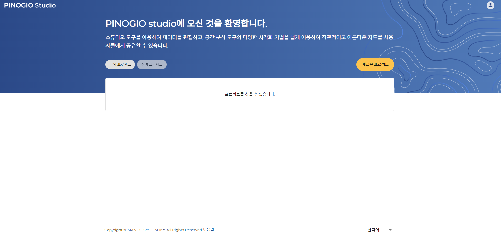
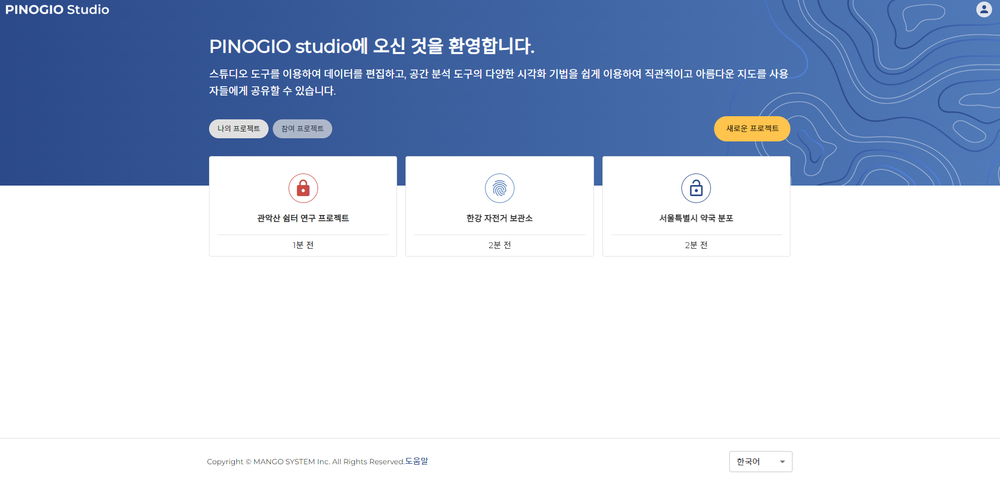
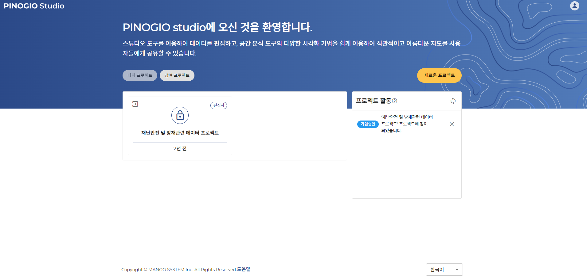

프로젝트 목록
==============================

접속하면 프로젝트 목록 화면이 표출됩니다.
프로젝트는 '나의 프로젝트'와 '참여 프로젝트'로 구분됩니다.

프로젝트는 **공개 범위** 에 따라 참여 방법이 다릅니다. 프로젝트를 새롭게 만들거나 다른 사용자의 프로젝트에 참여할 수 있습니다.

나의 프로젝트
-----------------------------

내가 만든 프로젝트가 있다면 위와 같이 프로젝트의 목록이 표출됩니다.

각각의 프로젝트에 대한 설명은 이후에 프로젝트 관리의  `새 프로젝트 만들기 <../project/index.html#id2>`_ 섹션 에서에서 설명하겠습니다.

참여 프로젝트
-----------------------------

참여 프로젝트는 다른 사용자가 만든 프로젝트에 내가 참가하고 있다면 내가 참여하고 있는 다른 프로젝트들의 목록이 표출됩니다.

참여 프로젝트에 대한 자세한 사항은 이후 프로젝트 관리의 `기존 프로젝트 참여하기 <../project/index.html#id3>`_ 섹션에서 설명하겠습니다.
