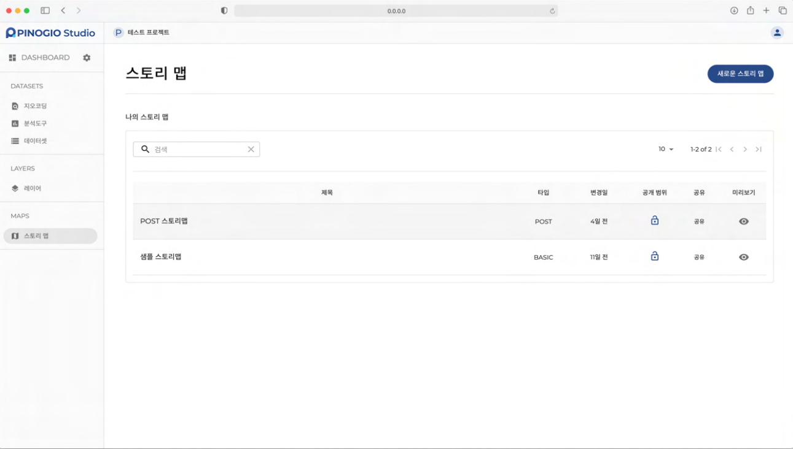
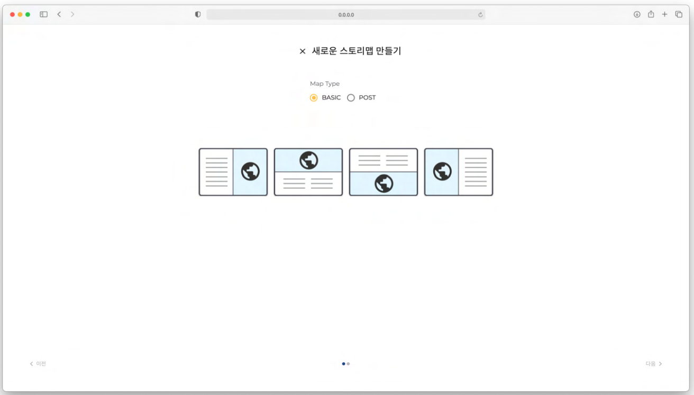
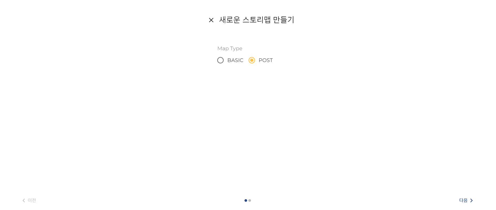
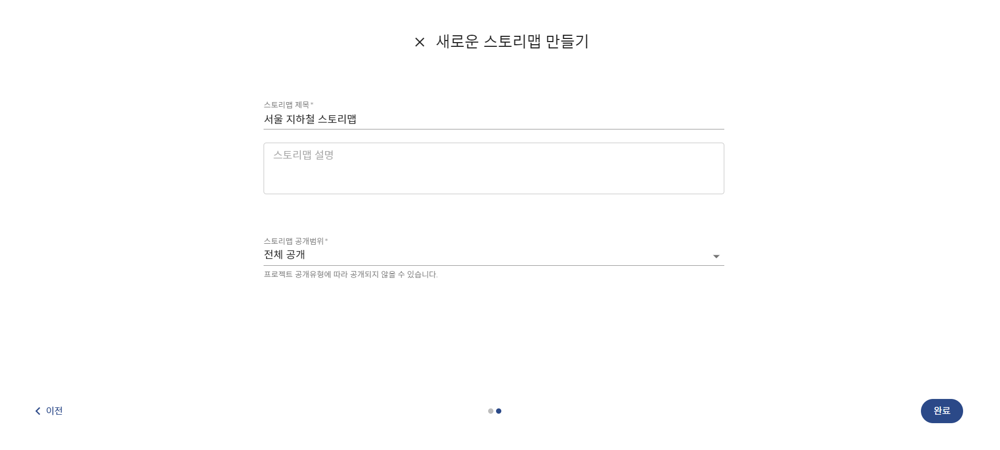

스토리맵
===============

스토리맵 개요
-----------------------------

**스토리맵**
스토리맵은 프로젝트의 데이터셋을 사용하여 공간분석을 거쳐 생성된 레이어로 만들어지는 지도입니다. 스토리맵의 내용은 사용자의 작성내용에 따라서 수많은 용도로 사용될 수 있습니다.

**기본형(BASIC) 스토리맵**
기본형 스토리맵은 가장 기초적인 스토리맵 입니다. 스토리맵 페이지 제목과 내용(콘텐츠) 를 담고있는 내용면과 사용되는 데이터를 보여줄 지도면으로 구성되어 있습니다.

**포스트형(POST) 스토리맵**
포스트형 스토리맵은 블로그 포스트와 유사한 구성의 스토리맵 입니다. 사용자가 원하는 위치에 내용(콘텐츠) 를 입력할 수 있으며, 구분선과 이미지 맵(지도) 를 추가할 수 있습니다.

스토리맵 만들기
-----------------------------

**기본형 스토리맵 만들기**

1. 스토리맵 페이지에서 **새로운 스토리 맵** 을 클릭합니다.
2. 스토리맵의 맵 타입의 기본값은 기 BASIC( ) , 4 본형 이며 개의 템플릿 중 한 개를 선택하고 **다음** 을 클릭합니다.
3. 스토리맵 **제목** 입력란에 스토리맵 제목을 입력합니다.
4. 스토리맵 **설명** 입력란에 스토리맵에 대한 설명을 입력합니다.
5. '스토리맵 **공개범위** 선택란에서 스토리맵의 공개범위를 선택합니다.
6. **완료** 를 클릭하여 새로운 스토리맵을 생성합니다.

**포스트형 스토리맵 만들기**

1. 스토리맵 페이지에서 **새로운 스토리 맵** 을 클릭합니다.
2. 스토리맵의 맵 타입을 로 POST 선택 후 **다음** 을 클릭합니다.

3. 스토리맵 **제목** 입력란에 스토리맵 제목을 입력합니다.
4. 스토리맵 **설명** 입력란에 스토리맵에 대한 설명을 입력합니다.
5. 스토리맵 **공개범위** 선택란에서 스토리맵의 공개범위를 선택합니다.
6. 완료를 클릭하여 새로운 스토리맵을 생성합니다.

스토리맵 검색하기
-----------------------------

.. warning::
    여기서부터는 현재 작성 중입니다.
